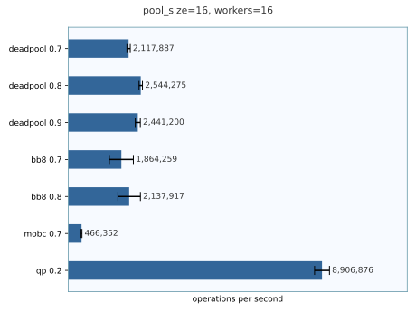
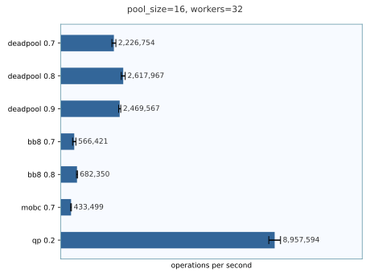

# Benchmark results

> ⚠ **Attention!** The following results include `bb8` and `qp` which
> seam to contain bugs which can cause deadlocks. This benchmark does
> not trigger those bugs but another one created by
> [Astro36](https://github.com/Astro36) does:
> [rust-pool-benchmark#1](https://github.com/Astro36/rust-pool-benchmark/issues/1)

## System details

```
❯ lscpu |grep -e "^CPU(s):" -e "^Model name:"
CPU(s): 16
Model name: Intel(R) Core(TM) i9-9900K CPU @ 3.60GHz
```

```
❯ cat /proc/meminfo |grep MemTotal
MemTotal: 131839000 kB
```

```
❯ lsb_release -a |grep Description
Description: Ubuntu 21.10
```

| pool_size = 8 | pool_size = 16 | pool_size = 32 |
| --- | --- | --- |
|  |  |  |
|  |  |  |
|  |  |  |
|  |  |  |
|  |  |  |
|  |  |  |
